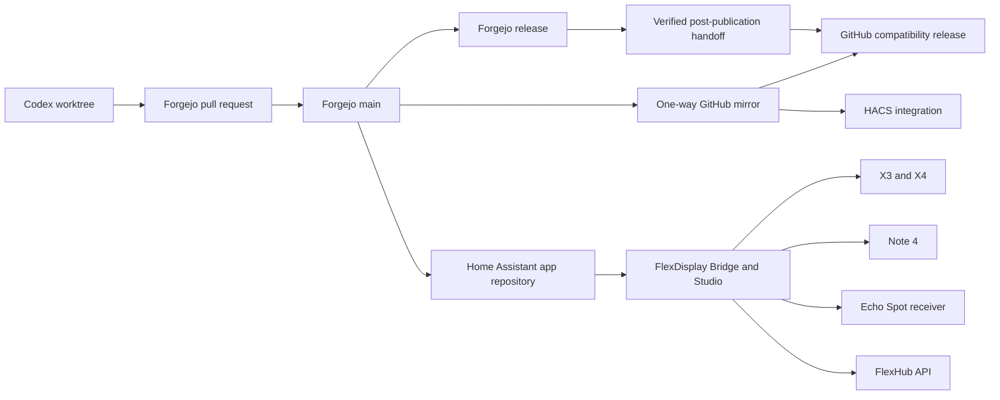

# FlexDisplay architecture

Forgejo is the authoritative forge. For this repository only, GitHub is an
approved downstream compatibility surface because HACS only consumes public
GitHub repositories, existing Home Assistant consumers may already use the
GitHub app-source URL, and some public release assets may be replicated there
after Forgejo publication.

## Authority rules

1. Code, issues, pull requests, reviews, CI, tags, and release notes originate
   in Forgejo.
2. For this repository only, GitHub accepts the Forgejo push mirror, gated
   compatibility-release automation after the Forgejo release succeeds, and
   private Security Advisories. This exception supports HACS, existing Home
   Assistant consumers, and public assets; it is not precedent for another
   repository. A mirrored tag alone is not release authorization.
3. Home Assistant may install the Bridge app directly from Forgejo.
4. HACS continues to install the integration from the GitHub mirror.
5. Runtime configuration, credentials, device identities, backups, and local
   network secrets are never committed.

## Version boundaries

The Bridge, Studio, and integration share one platform version because Studio
is shipped inside the Bridge and the integration calls the Bridge API. The
Echo Spot receiver, FlexHub firmware, and X3/X4 firmware use independent
versions recorded in `docs/COMPATIBILITY.md`.

`release-manifest.json` is the coordinated release source of truth. Runtime
package markers, the compatibility matrix, Android source metadata, packaged
artifact defaults, and generated `docs/RELEASE_STATUS.md` must agree with it.
The distribution entries remain separate because a commit, protected tag,
Forgejo release, GitHub compatibility release, Home Assistant deployment,
Android installation, firmware rollout and physical result are different
states with different evidence.
